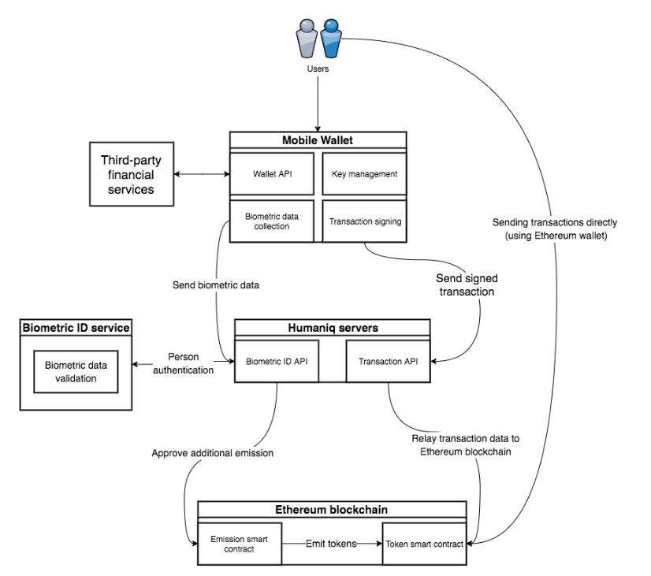

# Humaniq

The [Humaniq](https://humaniq.com/) platform offers  banking tools and an identity service based on biometric identification.
Among the services the platform aim at offering there are: P2P loans, insurances, remittances, 

The platform implements a tokenized economy. An initial amount of a token ([HMQ](https://etherscan.io/token/0xcbcc0f036ed4788f63fc0fee32873d6a7487b908))  is given free to anyone who joins in the system.
The early adopters should receive more tokens  than the later ones and the number of total tokens is fixed.  
Emission proceeds until kmax people are registered.

Then, the token can be gained as a reward for some behaviours such as  inviting friends and making transactions. Also, additional 
earning opportunities could be  provided by other entities(shop/companies). The earned token can  then be exchanged for fiat
currency ([coinmarketcap](https://coinmarketcap.com/currencies/humaniq/)) or used to pay for services or goods in those franchasing 
accepting it as form of payment.  

The application to access the system is an app for mobile with face-recognition login.  The whole bioidentification process
consists of taking series of photos, recording videos of the user making facial gestures, and recording the user’s speech; while 
to log in the user has to repeat just one of the recorded gestures in the front of the camera.
All the info related to one's identity are to be stored in a decentralized manner. 

## Platform structure

Humaniq major component (transaction settlement) will be done on Ethereum blockchain using Standard Token (ERC20) contract. 
New tokens are emitted for every authenticated user and the rules of emission are controlled by «Emission smart contract». 
Humaniq servers are responsible for authorization of users on the blockchain via Biometric ID services as well as approving 
additional token emission. Users will only interact with Mobile Wallet for their smartphones.
The mobile application will use all the pc's as nodes to store all the data of all the users' identity. 
The application is thought to  use Ethereum network to store transactions. 

There are three key components of Humaniq: the app (which is essentially also the 
[mobile wallet](https://etherscan.io/address/0xa2c9a7578e2172f32a36c5c0e49d64776f9e7883#tokentxns)), Humaniq servers, and 
contracts on Ethereum blockchain. There are two contracts that are already deployed on the blockchain.
First one is Standard Token Contract (ERC20) that keeps track of user balances and allows them to transfer tokens between each 
other.  Second one is responsible for token emission.

At the moment (September 2018) the pre ICO sales and ICO sales are over. The  platform should be running.
The source code is on [Github](https://github.com/humaniq).

